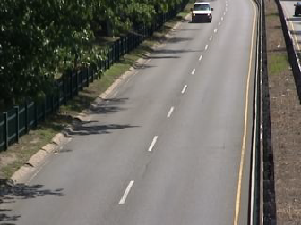
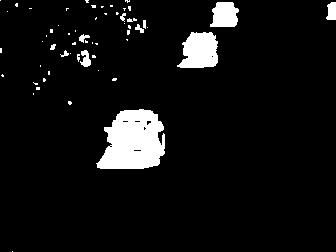

# Adaptive Median background for OpenCV

C++ implementation of the adaptive median background estimation described in McFarlane, N.J. and Schofield, C.P., 1995. Segmentation and tracking of piglets in images. *Machine vision and applications*, 8(3), pp.187-193.

The following features are also added
- Variable update steps (fixed to 1 in paper)
- Rate ramping for faster initialization in presence of foreground objects.


## Adaptive median
Adaptive median background estimation can be very effective under certain conditions:
1. Background visible more than 50% of the time.
2. Stable camera
3. Static/slowly drifting background

While limited to certain applications it has the advantage of having few hyperparameters and is computationaly inexpensive.

## Build and run/install
These instructions have been tested on Ubuntu 17.10 with OpenCV 3.4.3. Adapt according to your configuration.

Clone this github repo in current directory (or download manually):
```
git clone https://github.com/rfortiz/AMED-bgfg.git --single-branch
```
Create a build directory:
```
cd AMED-bgfg
mkdir build
cd build
```
Build:
```
cmake ..
make 
```
Demo and test are built by default. To disable change to:
```
cmake -DBUILD_DEMO=OFF -DBUILD_TEST=OFF ..
make
```

Run the demo and test:
```
make run
make run_test
```

Install as shared library:
```
sudo make install
sudo ldconfig
```
and add the link flag when linking your project
```
-L/usr/local/lib/ -lbgfgamed
```

## Usage

The algorithm can be used following the same BackgroundSubtractor interface as other background estimation methods in OpenCV.

```c++
Ptr<BackgroundSubtractorAMED> createBackgroundSubtractorAMED(double seg_threshold=20, int seg_blur_size=3, bool ramp_init=true, bool masked_update=false)
```

- **seg_threshold:** Intensity threshold to segment foreground objects.
- **seg_blur_size:** Size of box blur applied on abs(current_frame-background) before thresholding. Reduces noise but reduces precision of object boundaries. Set to '1' to disable.
- **ramp_init:** If true, starts with high learning rate and ramps down for fast initialization. Set to 'false' if the first frame does not contain foreground objects.
- **masked_update:** If true, regions with foreground objects are are not updated. Only applies after ramping learning rate. Only small/gradual changes (i.e. below 'threshold') will be incorporated in the background. When true, objects removed from the background, will create permanent ghosts.

The "updateRate" in OpenCV interface corresponds to the "update step" in the formula above.

## Example: combine slow and fast update rates to remove ghosts and deal with intermittent motion

```c++
#include <opencv2/opencv.hpp>
#include <iostream>
#include "bgfg_amed.hpp"

using namespace std;
using namespace cv;

int main(int /*argc*/, char** /*argv[]*/)
{
    namedWindow("frame",CV_WINDOW_KEEPRATIO);
    namedWindow("foreground",CV_WINDOW_KEEPRATIO);
    
    Mat frame, foreground, foreground2;
    char key;
    
    VideoCapture cap(-1);
    if(!cap.isOpened()){
        cout << "Error opening video stream or file" << endl;
        return -1;
    }
    
    Ptr<BackgroundSubtractor> pAMED;
    pAMED = createBackgroundSubtractorAMED(20, 3, true, true); // not update where foreground objects are present
    
    Ptr<BackgroundSubtractor> pAMED2;
    pAMED2 = createBackgroundSubtractorAMED(20, 5, true, false);
    
    cap >> frame;
    double t = (double)getTickCount(); // start timer
    while(!frame.empty()){
        imshow("frame", frame);
        
        // update both background models
        pAMED->apply(frame, foreground, 0.1); // slow update
        pAMED2->apply(frame, foreground2, 2); // fast update
        
        //combine ouput
        bitwise_and(foreground, foreground2,foreground);

        imshow("foreground", foreground);
        
        cap >> frame;
        
        key=(char) waitKey(1);
        if(key == (char)27){
            break;
        }
    }

    cap.release();
    destroyAllWindows();
    
    return 0;
}
```

Here is an example with a sequence from the change detection challenge that provides a benchmark to compare algorithms under various test conditions. ([www.changedetection.net](http://www.changedetection.net/))
	
Current frame  


Slow update rate with mask. Ghost due to car present on the first frame.  
 

Fast update rate. Objects are incorporated too fast in the background, leaving some trail behind.  
 

Combination of both.  


